# ImovirtualAPI


ImovirtualAPI is a Python package for querying real estate listings from the [imovirtual](https://www.imovirtual.com/) website. It allows users to search for properties based on various criteria and retrieve the data in either JSON format or as a pandas DataFrame.


The querying properties available are the same as the filtering properties in the website.

## Features

- Search properties by transaction type, property type, location, price, area, and more.
- Supports pagination to retrieve all listings across multiple pages.
- Returns results in JSON format or as a flattened pandas DataFrame.

## Available data

```mermaid
erDiagram
    PROPERTY {
        int id
        string title
        string slug
        string estate
        string developmentId
        string developmentTitle
        string developmentUrl
        string transaction
        string images
        boolean isExclusiveOffer
        boolean isPrivateOwner
        boolean isPromoted
        string openDays
        float rentPrice
        float priceFromPerSquareMeter
        float areaInSquareMeters
        float terrainAreaInSquareMeters
        int roomsNumber
        boolean hidePrice
        int floorNumber
        string investmentState
        float investmentUnitsAreaInSquareMeters
        float peoplePerRoom
        date dateCreated
        date dateCreatedFirst
        int investmentUnitsNumber
        int investmentUnitsRoomsNumber
        date investmentEstimatedDelivery
        date pushedUpAt
        boolean specialOffer
        string shortDescription
        string __typename
        int totalPossibleImages
        float location_mapDetails_radius
        string location_mapDetails___typename
        string location_address_street_name
        string location_address_street_number
        string location_address_street___typename
        string location_address_city_name
        string location_address_city___typename
        string location_address_province_name
        string location_address_province___typename
        string location_address___typename
        string location_reverseGeocoding_locations
        string location_reverseGeocoding___typename
        string location___typename
        int agency_id
        string agency_name
        string agency_slug
        string agency_imageUrl
        string agency_type
        boolean agency_brandingVisible
        int agency_highlightedAds
        string agency___typename
        float totalPrice_value
        string totalPrice_currency
        string totalPrice___typename
        float pricePerSquareMeter_value
        string pricePerSquareMeter_currency
        string pricePerSquareMeter___typename
        string agency
        string location_address_street
    }
```



## Project Structure

```
my_project/
│
├── imovirtual_api/
│   ├── __init__.py
│   └── imovirtual_api.py
├── tests/
│   ├── __init__.py
│   └── test_imovirtual_api.py
└── README.md
```


## Installation

1. Clone the repository:
    ```sh
    git clone https://github.com/miguelsiloli/imovirtual_api.git
    ```

2. Navigate to the project directory:
    ```sh
    cd imovirtual_api
    ```

3. (Optional) Create and activate a virtual environment:
    ```sh
    python -m venv venv
    source venv/bin/activate  # On Windows, use `venv\Scripts\activate`
    ```

4. Install the required dependencies:
    ```sh
    pip install -r requirements.txt
    ```

## Usage

### Basic Query Example

```python
from imovirtual_api.imovirtual_api import ImovirtualAPI

api = ImovirtualAPI()

results = api.query_imovirtual(transaction_type='comprar', location='lisboa')

print(results)
```

### Advanced Query Example with Multiple Pages and JSON Response

```python
from imovirtual_api.imovirtual_api import ImovirtualAPI

api = ImovirtualAPI()

results = api.query_imovirtual(
    transaction_type='arrendar',
    property_type='apartamento',
    location='porto',
    price_min=500,
    price_max=1500,
    area_min=50,
    rooms_number=['ONE', 'TWO', 'THREE],
    sort_by='price',
    sort_direction='ASC',
    json=True
)

print(results)
```

### About locations

Location params are nested, from the top parent province, to parish/council level and street name (not every listing displays this information for privacy). If you want to query a parish, you need to place the **full path**:

```python
from imovirtual_api.imovirtual_api import ImovirtualAPI

api = ImovirtualAPI()

results = api.query_imovirtual(
    transaction_type='arrendar',
    property_type='apartamento',
    location='porto/porto',
)

print(results)
```


## Future Work

- Fix any bugs and maintain code
- Implement all the query params
- Improve testing and documentation

Perhaps it would be helpful to have some string standardization for string inputs and other sorts of **poka-yoke**.
